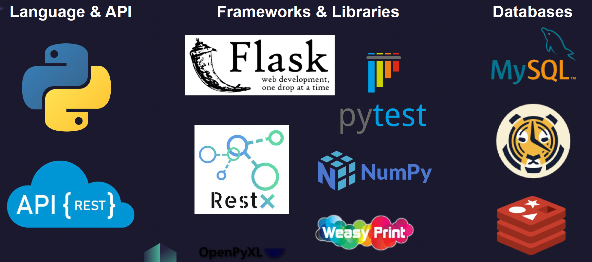

## Industry-Sponsored Capstone - Group Project

Our software engineering capstone project was for a confidential financial services smb and our work cannot be shared. This README provides some highlights of the work.

### Tools and Technologies

### Primary Objectives
1. Extract business logic from our sponsor's monolithic legacy application.
2. Redesign and implement the logic using an efficient microservices-based architecture and modern technologies.
3. Add an API for the modernized application.

### Primary Benefits to Sponsor
1. Application performance.
2. Maintainability.
3. Commercialization opportunites (i.e.,domain logic access via API, or sale of domain as a library).

### Functionalities
The new application has a wide range of functionalities and features, including custom report generation, forecasting, and a full featured secure API built with support for data analytics. Ideas for potential Machine Learning applications were also developed. 
